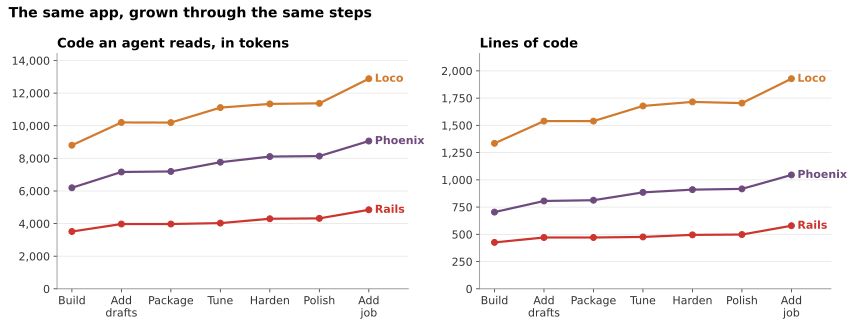
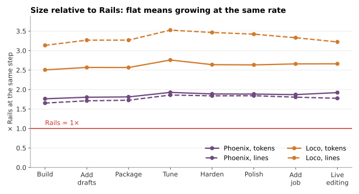

# AgentMVC

**Which language and framework help agents build and evolve a large application with the most domain signal and the least incidental code?**

AgentMVC gives coding agents the same [RealWorld Conduit](https://github.com/realworld-apps/realworld) backend contract, then compares the code they produce, its correctness, and its runtime behavior. It is also a growing set of working references: measured one-shot builds stay frozen while later, clearly labeled revisions push each framework further. The contract adds drafts, background exports, and live shared editing; a [fixed Lit editor](frontend/) exercises the live protocol.

## Start with the current code

| Stack | Current source for agents to explore | Current owned backend | Current anonymous list† | Framework strengths in this app |
| --- | --- | ---: | ---: | --- |
| Ruby · Rails | [Rails reference](results/one-shot-v2-rails-expert/pilot-1/reference-1/source/) | 6,085 tokens · 657 lines | 608–618 req/s | Active Record, jobs, domain services |
| Elixir · Phoenix | [Phoenix reference](results/one-shot-v2-phoenix-expert/reference-2/source/) | 12,893 tokens · 1,464 lines | 5,139–5,183 req/s | Ecto, PubSub, supervised rooms |
| TypeScript · AdonisJS | [AdonisJS reference](results/one-shot-v2-typescript-expert/expert-1/reference-1/source/) | 10,546 tokens · 1,168 lines | 3,517–3,545 req/s | Routing, typed services, queue |

These reference revisions are **unscored improvements** to the measured builds. Each source tree includes an `AGENTS.md` rule map. † The current-list figures come from a [short, paired reference diagnostic](results/v2-expert-symmetry/reference-runtime/summary.json): two 10-second rounds at 16 users, not the full nine-workload one-shot benchmark. See the [current three-stack results](results/v2-expert-symmetry/README.md) for validation and remaining limits.

### The matched one-shot baseline

One agent per stack received the [same frozen prompt](one-shot-v2-expert/PROMPT.md), product contract, client, and gates, with a separately frozen, stack-specific environment and product-free scaffold. These numbers describe the **original measured snapshots**, not the evolving references linked above.

| Measured stack | Agent-owned backend | Anonymous article list¹ | SQL/list | Source |
| --- | ---: | ---: | ---: | --- |
| Rails · Ruby | 6,010 tokens · 644 lines | 604–606 req/s | 4 | [snapshot](results/one-shot-v2-rails-expert/pilot-1/source/) |
| Phoenix · Elixir | 12,145 tokens · 1,359 lines | 5,124–5,201 req/s | 4 | [snapshot](results/one-shot-v2-phoenix-expert/pilot-1/source/) |
| AdonisJS · TypeScript | 10,027 tokens · 1,110 lines | 3,371–3,438 req/s | 2 | [snapshot](results/one-shot-v2-typescript-expert/expert-1/source/) |

¹ Two same-session production rounds, 16 virtual users, with the app and PostgreSQL each limited to 2 CPUs and 1 GiB. All three independently passed the full development and fresh-production gates. The [results page](results/v2-expert-symmetry/README.md) gives the other workloads, held-out failures, source counts, run records, and raw-measurement provenance. This is one agent run per stack, not a population estimate or a language ranking.

[Explore the comparison](results/v2-expert-symmetry/README.md) · [Read the prompt](one-shot-v2-expert/PROMPT.md) · [Contribute a revision or track](CONTRIBUTING.md)

Other recorded paths include [Loco / Rust in the eight-step study](stacks/loco/), [IHP / Haskell](results/one-shot-ihp/README.md), and a [Servant / Haskell pilot](results/one-shot-v2-servant/README.md). Their briefs and measurement sessions differ, so they have their own result pages.

## Go and Python: complete tracks

Both completed the original eight-step sequence and separate expert one-shots: **18 measured builds, all passing the independent gates required for their phase**. All four final applications passed development and production checks. Additional review found defects; the separately labeled references below repair them and pass every supplemental probe.

| Reviewed reference | Actual stack | Owned backend | Source |
| --- | --- | ---: | --- |
| Go · eight steps | chi, Bun, Goose, River | 14,249 tokens | [Code](results/lanes/go/8-live-editing/reference-1/source/) |
| Go · one-shot | chi, mostly SQL through Bun, Goose, River | 12,846 tokens | [Code](results/one-shot-v2-go-expert/pilot-1/reference-1/source/) |
| Python · eight steps | Django, Ninja, Channels, Procrastinate | 8,429 tokens | [Code](results/lanes/python/8-live-editing/reference-1/source/) |
| Python · one-shot | Same libraries, with a central domain module and custom room registry | 9,058 tokens | [Code](results/one-shot-v2-python-expert/pilot-1/reference-2/source/) |

Python's eight-step reference uses more framework services directly. Its one-shot consolidates author and shared edits into one operation. Go's one-shot is smaller than its sequential counterpart, but uses Huma only for health and tags; these results do not establish what a full typed-Huma implementation could achieve. [Go code guide](results/lanes/go/README.md) · [Python code guide](results/lanes/python/README.md).

The [lane comparison](results/lanes/README.md) includes two repeated production rounds for all four originals and all four reviewed references, every checkpoint, prompt, effort count and reviewer finding. [Scrubbed transcripts and raw measurements](https://github.com/sheetgenius/agentmvc/releases/tag/go-python-lanes-v1) are available separately as release downloads. These prepared-scaffold runs have their own recorded conditions; their timing session differs from the three-stack table above. The original study below remains intact.

Try a reviewed app with `tools/lane_demo.sh go one-shot-reference` or `tools/lane_demo.sh python eight-reference` (Docker and Node.js required).

## Clojure: in progress

The [Clojure track](results/lanes/clojure/README.md) uses the same eight prompts and a separate expert one-shot. Its product-free Ring/Reitit scaffold has passed environment preflight and is frozen for measurement. [Stack selection](stacks/clojure/SELECTION.md) · [Recorded conditions](results/lanes/clojure/METHODOLOGY.md). No completed Clojure product result is claimed yet.

## Original eight-step study

The earlier Rails, Phoenix, and Loco implementations followed eight prompts: build the app; add drafts; package; tune; harden; polish; add a background export; add live shared editing. Each step has the same acceptance suite, size measure, security checks, and production benchmarks. This history is separate from the expert-guided one-shot table above. [Methodology](docs/methodology.md) · [Findings](docs/README.md) · [Try the step-8 app](tools/demo.sh) (`tools/demo.sh rails|phoenix|loco`, Docker and Node.js required).

<!-- stats:start -->
| | [Rails](stacks/rails/) (Ruby) | [Phoenix](stacks/phoenix/) (Elixir) | [Loco](stacks/loco/) (Rust) |
| --- | ---: | ---: | ---: |
| Code an agent reads, after the last step (tokens) | 6,259 | 12,029 (1.92×) | 16,653 (2.66×) |
| Lines of code, after the last step | 770 | 1,367 (1.78×) | 2,481 (3.22×) |
| Code to add drafts, step 2 (tokens) | 632 | 1,190 (1.88×) | 1,689 (2.67×) |
| Code to add a background job, step 7 (tokens) | 526 | 953 (1.81×) | 1,566 (2.98×) |
| Code to add live editing, step 8 (tokens) | 1,490 | 3,024 (2.03×) | 3,823 (2.57×) |
| Article list after tuning, median of runs (req/s) | 259 | 4,990 (19×) | 5,403 (21×) |
| Peak memory under load, after tuning | 128 MB | 177 MB | 104 MB |
| Docker image | 334 MB | 165 MB | 140 MB |
| Cold start | 1.2 s | 1.2 s | 0.3 s |
| Security checks passed, before → after hardening (of 13) | 11 → 13 | 10 → 13 | 11 → 13 |
| Fresh agent's comprehension score, after steps 1 and 6 (of 12) | 12 · 11.5 | 11.5 · 12 | 11.5 · 11.5 |
| Agent effort, all steps (tokens, wall-clock) | 824k tokens, 97 min | 853k tokens (1.04×), 99 min (1.02×) | 1,032k tokens (1.25×), 115 min (1.19×) |
<!-- stats:end -->

Code size is counted in LLM tokens (`o200k`) and lines, over the backend application source an agent would read. The shared [Lit editor](frontend/) is measured separately and excluded from every stack. Ratios are relative to Rails. The article-list speed row is the earlier HTTP benchmark, measured on one machine with each app and its database limited to 2 CPUs and 1 GB under 16 concurrent users. Step-8 socket measurements are in [the live-editing results](results/live-editing/). Per-step detail is in [`stacks/`](stacks/) and [the findings](docs/findings/).





### What the eight-step numbers show

- **The same backend took 1.92× the code in Phoenix and 2.66× in Loco.** After eight steps, its source is 6,259 tokens in Rails, 12,029 in Phoenix, and 16,653 in Loco. [Size →](docs/findings/size.md)
- **The gap stayed in a narrow band as the app grew.** From step 1 to step 8, Rails grew 78%, Phoenix 94%, and Loco 89%. One live-editing step adds a new kind of complexity; it cannot by itself establish a growth trend. [Size →](docs/findings/size.md)
- **Live editing was the largest feature change so far.** It added 1,490 tokens in Rails, 3,024 in Phoenix, and 3,823 in Loco. The shared client is excluded from those numbers. [Live-editing analysis →](docs/findings/live-editing.md)
- **Every step passed in every stack.** Over eight steps, Phoenix took about the same agent tokens and time as Rails; Loco took 1.25× the tokens and 1.19× the time. The step-8 agent runs include browser sandbox setup friction.
- **Phoenix and Loco were about 20× faster on the same 2 CPUs.**
  - Every first draft had the same N+1 queries. Once each agent fixed them, Phoenix and Loco served 19× and 21× Rails' article-list throughput.
  - Rails' fix was the smallest.
  - Rails ran a single Puma process. Two worker processes gain it about 1.7×. [Speed →](docs/findings/speed.md)
- **Reading was closer than writing.** Fresh agents scored 11.5–12 out of 12 on questions about every codebase, reading only 1.2–1.75× Rails' input. [Comprehension →](docs/findings/comprehension.md)
- **Security reached parity by different routes:** Rails' built-in features, Loco's types, and a library in Phoenix. [Security →](docs/findings/security.md)
- **A free polish pass shrank nothing.** Every agent moved rules to where its stack expects them, and every codebase changed size by less than 1%. [Polish →](docs/findings/polish.md)

### The app and the eight prompts

The app is the RealWorld "Conduit" backend: users, profiles, follows, articles, comments, favorites and tags. It's defined by the [pinned spec](spec/) and its public Hurl acceptance suite of 154 requests, run unmodified. AgentMVC added [drafts](spec/features/drafts/drafts.md), [exports built in a background job](spec/features/exports/exports.md), and [live shared editing](spec/features/live-editing/live-editing.md). The live-editing fixture has 18 HTTP requests, a direct socket check, and three browser tests; it was validated against a separate reference implementation before the backend agents started.

| Step | The agent is asked to | Prompt |
| --- | --- | --- |
| 1 | Build the app from the spec, clean, terse and idiomatic | [`1-build`](steps/1-build.md) |
| 2 | Add drafts, publishing and edit conflicts | [`2-add-drafts`](steps/2-add-drafts.md) |
| 3 | Package it for production, with a check against the production image | [`3-package`](steps/3-package.md) |
| 4 | Make it fast, given its benchmark results | [`4-tune`](steps/4-tune.md) |
| 5 | Harden it, given its security scan | [`5-harden`](steps/5-harden.md) |
| 6 | Polish it, with free rein, in up to three passes | [`6-polish`](steps/6-polish.md) |
| 7 | Add article exports, built in a durable background job | [`7-add-background-job`](steps/7-add-background-job.md) |
| 8 | Add revocable editing links, live updates, presence and a 100-person room cap | [`8-live-editing`](steps/8-live-editing.md) |

Run `tools/demo.sh rails|phoenix|loco` to build one step-8 backend, start PostgreSQL and the shared editor, and print a link to paste into more tabs or browsers. Set `DEMO_ORIGIN` to a reachable origin when sharing across devices.

After steps 1 and 6, a fresh, read-only agent answers [12 questions about the domain](comprehension/questions.md) from the code alone.

### How the eight-step study was run

- **One agent per stack per step, from a byte-identical prompt.** The only stack-specific text is a short [`ENVIRONMENT.md`](stacks/rails/ENVIRONMENT.md). No agent knows about the other stacks.
- **Every step is verified** by rerunning the agent's own `bin/check`: the acceptance suite, the formatter and the linter. From step 3, `bin/check-production` runs too, against the production image. The results are recorded in each stack's `runs.json`.
- **Code size** counts the application source only. Tests, lockfiles, dependencies and generated schema are left out. [`tools/measure.py`](tools/measure.py) reads each stack's rules from its `stack.json`.
- **Speed** is measured with k6 against each production image, with SQL statements counted per request. Step 8 adds direct WebSocket and HTTP save measurements at 10, 100 and 500 subscribers, with the larger load spread across articles.
- **Security** is 13 black-box checks, plus OSV-Scanner and the stack's own analyzer where one exists.
- **Every agent session is published,** with its report and scrubbed transcript, next to the code in [`stacks/`](stacks/).

[The methodology](docs/methodology.md) covers the details. [The research log](docs/research-log.md) records what went wrong along the way, and how it was handled.

### Reproduce the historical steps

Use [`tools/run-step.py`](tools/run-step.py) with a stack's frozen environment and prompt, [`tools/check.sh`](tools/check.sh) for its gates, and [`tools/report.py`](tools/report.py) for the original tables and charts. The [eight-step methodology](docs/methodology.md) gives the exact boundaries. The quick commands below target this historical lane.

```bash
pip install -r tools/requirements.txt
python3 tools/measure.py rails                   # code size at every step
python3 tools/report.py                          # rebuild results/, the charts and the table above
tools/check.sh rails 8-live-editing               # rerun a step's checks (needs Docker and the stack's toolchain)
tools/demo.sh rails                               # print a live editing link; Ctrl-C stops the demo
python3 tools/live-bench.py                       # repeat direct socket load measurements
tools/bench/run.sh rails 4-tune                  # benchmark a step's production image
tools/security/scan.sh rails 5-harden            # scan it
```

For a fresh full-product build, [`tools/one_shot.py`](tools/one_shot.py) prepares one self-contained workspace per stack with the shared prompt, spec, Lit client, browser harness, and measurement rules. See the [one-shot setup](one-shot/README.md), the [completed first run](results/one-shot/README.md), and the [semantic-density run](results/one-shot-semantic-density/README.md). The newer [Servant safe-evolution pilot](one-shot-v2/README.md) and [TypeScript track](one-shot-v2-typescript/README.md) share a different frozen prompt for changeability at large scale. The [expert-guided TypeScript and Phoenix tracks](one-shot-v2-expert/README.md) add versioned stack guidance and report their results separately. The [workshop plan](docs/semantic-density-workshop.md) explains that question.

### Caveats of the eight-step study

- **One model, and one run per stack per step.** Small differences are noise; the size of a gap is more reliable than its exact value.
- **This is still a small product.** Step 8 adds one real-time feature on a single backend instance; it does not test multi-instance coordination or media processing.
- **Speed numbers come from one shared workstation.** Identical images varied by up to 1.5× between runs, so the table uses the median of several runs.
- **One reviewer wrote the feature specs, security checks and answer keys.** Hypotheses were recorded before the earlier benchmark, scan, and reading steps; every answer key was written before grading. Step 8 froze its protocol and measurement plan before implementation.

The full list is in [docs/caveats.md](docs/caveats.md).

## Why this exists

AgentMVC started as R&D at [BitterClip](https://bitterclip.com), a Rails product with about 3 million tokens of application code, more than three times a 1-million-token context window. Its founder, [@ruemic](https://x.com/ruemic), kept hearing that everything should move to Rust because agents would do all the reading and writing. When agents do the reading, what matters is how much of a product fits in their context, so the question became measurable: how much more code does the same product take in another stack, and what does it buy?

## Contribute

You can improve a current reference, add a new framework track, or reproduce a frozen run. Label iterative improvements separately from one-shot results and include the source, checks, and comparable measurements behind any performance claim. [CONTRIBUTING.md](CONTRIBUTING.md) explains the lanes and review checklist.

## Repository map

```
spec/                 the app: RealWorld's API spec and Hurl suite (MIT), plus the three added features
frontend/             the frozen shared Lit editor and browser tests, excluded from backend code size
one-shot/             the separate full-product prompt, client, fixed harness and fixture manifest
one-shot-v2/          the safe-evolution prompt and Servant pilot environment
one-shot-v2-typescript/  the same prompt with an AdonisJS and TypeScript environment
one-shot-v2-expert/   shared safe-evolution prompt and measurement rules
one-shot-v2-{rails,phoenix,typescript}-expert/  frozen track-specific environments and scaffolds
steps/                the eight prompts and the comprehension prompt, identical for every stack
stacks/<stack>/       stack.json, ENVIRONMENT.md, scaffold/ (generator output), the code after each step,
                      reports/, transcripts/ and runs.json
comprehension/        questions, answer keys, grades and every answer
results/v2-expert-symmetry/  current three-stack comparison and paired production measurements
results/              historical sizes, benchmarks, security scans and charts
docs/                 methodology, findings, caveats and the research log
tools/                run a step, check it, measure, benchmark, scan, scrub a transcript, rebuild the report
```

## License

MIT; see [LICENSE](LICENSE). The RealWorld spec in `spec/` is MIT-licensed by its authors; see [spec/LICENSE](spec/LICENSE).
