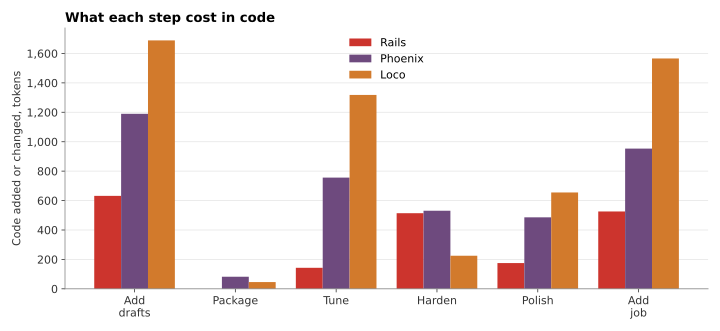

# Change cost: what does each step cost once the app exists?

Day one pays for scaffolding. After that, most work adds to and changes an app that already exists. For every step, [`tools/measure.py`](../../tools/measure.py) counts the code the agent added or changed relative to the step before. The generated Solid Queue schema is excluded from Rails' step 7, as pre-registered; see [background jobs](background-jobs.md).

| Step | Rails, tokens | Phoenix | Loco |
| --- | ---: | ---: | ---: |
| 2. Add drafts | 632 | 1,190 (1.88×) | 1,689 (2.67×) |
| 3. Package | 0 | 82 | 46 |
| 4. Tune | 143 | 756 (5.29×) | 1,318 (9.22×) |
| 5. Harden | 514 | 531 (1.03×) | 225 (0.44×) |
| 6. Polish | 175 | 486 (2.78×) | 655 (3.74×) |
| 7. Add a background job | 526 | 953 (1.81×) | 1,566 (2.98×) |

Agent effort per step, in uncached input plus output tokens and wall-clock time:

| Step | Rails | Phoenix | Loco |
| --- | ---: | ---: | ---: |
| 1. Build | 161k, 12.7 min | 168k, 17.3 min | 229k, 20.2 min |
| 2. Add drafts | 65k, 4.7 min | 68k, 8.0 min | 97k, 15.8 min |
| 3. Package | 77k, 9.4 min | 68k, 9.1 min | 75k, 7.3 min |
| 4. Tune | 92k, 21.4 min | 124k, 18.1 min | 105k, 18.7 min |
| 5. Harden | 73k, 6.9 min | 84k, 9.0 min | 94k, 7.7 min |
| 6. Polish | 79k, 6.1 min | 89k, 6.8 min | 129k, 8.9 min |
| 7. Add a background job | 102k, 10.2 min | 56k, 4.7 min | 123k, 9.6 min |
| **All seven steps** | **648k, 71 min** | **657k (1.01×), 73 min (1.02×)** | **852k (1.31×), 88 min (1.24×)** |

## Reading

- **Features cost the same multiple as the codebase.** Drafts took 1.88× Rails' code in Phoenix and 2.67× in Loco. The background job took 1.81× and 2.98×. The whole app sits at 1.76–1.93× and 2.51–2.76×.
- **Other steps cost whatever the framework doesn't provide.**
  - **Tuning:** mostly one `includes` call in Rails, against explicit batching code in Phoenix and Loco.
  - **Hardening:** cheapest in Loco. Its typed request structs already rejected malformed bodies, and its security headers were one configuration switch.
  - **Packaging:** a Dockerfile, and nearly no application code anywhere.
- **Agent effort grows less than code does.** Over all seven steps, Phoenix took about the same agent tokens and time as Rails, and Loco about 1.3× the tokens and 1.2× the time. Wall-clock time follows the feedback loop:
  - Phoenix's toolchain ran only through Docker, so every `mix` command started a container.
  - Loco compiled on every check.
