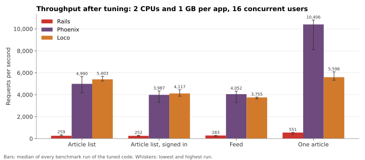

# Speed: what does each stack deliver under identical load?

The setup is in the [methodology](../methodology.md#speed). In short, each production image and its PostgreSQL get their own containers, limited to 2 CPUs and 1 GB. The data is identical, and the load is 16 concurrent k6 users per scenario. In the tables below, each cell gives requests per second · p95 latency in ms · SQL statements per request.

## Hypotheses, written before the benchmarks ran

- **H1:** as packaged, Loco has the highest throughput and the lowest memory, Phoenix the steadiest tail latency, and Rails the lowest throughput and the highest memory.
- **H2:** every stack issues many SQL statements per list request: N+1 queries on favorite and following state.
- **H3:** tuning brings list endpoints down to a roughly constant number of statements. The code it takes is smallest in Rails, where preloading is one line.

## Step 3: packaged for production

Each agent wrote a production `Dockerfile` and a `bin/check-production` that runs the acceptance suite against the image. The application code barely changed: 0 tokens in Rails, 82 in Phoenix and 46 in Loco. The Dockerfiles ran to 37, 26 and 16 lines.
- **Rails:** Puma with its default of 3 threads in a single process, and `db:prepare` at boot.
- **Phoenix:** a Bandit release on Debian slim, an Ecto pool of 10, and a release module that runs migrations at boot.
- **Loco:** Axum on Tokio's multi-threaded runtime, a pool of 10, migrations at boot, and a non-root Debian runtime.

| Scenario | Rails | Phoenix | Loco |
| --- | ---: | ---: | ---: |
| Article list | 90 · 206 · 44.89 | 1,495 · 30 · 23 | 801 · 37 · 42 |
| Article list, signed in | 62 · 289 · 66.96 | 790 · 31 · 64 | 537 · 49 · 83 |
| Articles by tag | 82 · 224 · 53.27 | 1,331 · 35 · 23 | 799 · 25 · 41 |
| Feed | 62 · 289 · 67 | 750 · 35 · 64 | 491 · 52 · 84 |
| One article | 544 · 38 · 6.98 | 8,236 · 3 · 6 | 6,840 · 3 · 6 |
| Comments | 819 · 26 · 3.97 | 11,828 · 2 · 4 | 10,153 · 2 · 4 |
| Tags | 1,610 · 13 · 1 | 6,821 · 3 · 1 | 2,044 · 15 · 1 |
| Favorite, then unfavorite | 490 · 40 · 9.45 | 3,246 · 7 · 7 | 3,339 · 7 · 7 |
| Create an article | 426 · 46 · 10 | 2,744 · 9 · 6 | 3,232 · 9 · 6 |
| Peak memory | 149 MB | 167 MB | 105 MB |
| Image size | 334 MB | 165 MB | 140 MB |
| Cold start | 1.1 s | 0.8 s | 0.3 s |

**Reading:**
- **As packaged, Rails was 10–15× slower than the other two.** Part of that is configuration: one Puma process with 3 threads can use about one of its two CPUs. Part is the N+1 queries.
- **H2 holds.** Every stack ran N+1 queries on list endpoints: 45–67 statements per list request in Rails, 23–64 in Phoenix and 41–84 in Loco.
- **H1 holds only partly.**
  - Loco had the lowest memory, the smallest image and the fastest cold start.
  - Rails had the lowest throughput.
  - But Phoenix, not Loco, led on most read endpoints, and Phoenix, not Rails, used the most memory.
- **Loco's tags endpoint was slow for Loco,** because it loaded every article to collect tags.

## Step 4: tuned

Each agent received its benchmark results and the benchmark itself, and was asked to make the app fast where it matters without making the code worse.
- **Rails:**
  - added `includes(:author, :tags, :favorites)` on the list query, plus one load of the reader's followed users;
  - added two model helpers that use preloaded associations when present;
  - preloaded comment authors.

  It tried 5 Puma threads instead of 3, found no clear gain, and reverted. It never added worker processes.
- **Phoenix:**
  - batched favorite counts and the reader's relationships per page;
  - joined authors into the article query;
  - added an index on `favorites.article_id`;
  - lowered production request logging to warnings.
- **Loco:**
  - batched authors, favorite counts and relationships per page;
  - moved tags into a `jsonb` column with a GIN index, so tag filtering and pagination run in PostgreSQL;
  - stopped loading article bodies for `/api/tags`.

| Scenario | Rails | Phoenix | Loco |
| --- | ---: | ---: | ---: |
| Article list | 259 · 80 · 6 | 4,172 · 6 · 4 | 5,679 · 4 · 4 |
| Article list, signed in | 218 · 89 · 8 | 3,313 · 7 · 7 | 4,457 · 5 · 7 |
| Articles by tag | 276 · 70 · 3 | 4,375 · 5 · 4 | 5,472 · 4 · 4 |
| Feed | 192 · 116 · 8 | 3,284 · 7 · 7 | 3,784 · 7 · 7 |
| One article | 391 · 57 · 6.98 | 8,123 · 3 · 4 | 5,326 · 4 · 5.98 |
| Comments | 605 · 38 · 3 | 10,726 · 3 · 3 | 6,286 · 3 · 4 |
| Tags | 954 · 24 · 1 | 6,011 · 4 · 1 | 3,778 · 8 · 1 |
| Favorite, then unfavorite | 330 · 69 · 9.44 | 2,907 · 8 · 5 | 2,736 · 10 · 6.98 |
| Create an article | 289 · 71 · 10 | 4,778 · 5 · 4 | 3,723 · 7 · 5 |
| Peak memory | 128 MB | 177 MB | 104 MB |

**Reading:**
- **H3 holds on both counts.**
  - Every stack's list endpoints now run 3–8 statements per request.
  - The code this took: 143 tokens in Rails, 756 in Phoenix (5.3×) and 1,318 in Loco (9.2×). Loco's figure includes the `jsonb` storage change, which also delivered its largest gains.
- **The gains were large, measured against the step-3 images benchmarked again straight afterwards:**
  - Rails' list endpoints: 3.0–3.5×;
  - Phoenix's: 3.1–4.9×;
  - Loco's: 8.5–11.8×.

  Outside the lists, only Loco's tags (2.2×) and Phoenix's article creation (2.0×) moved beyond the noise.
- **The gap between stacks widened.** Across every benchmark run of the tuned code, the median article-list throughput was 259 req/s for Rails, 4,990 for Phoenix (19×) and 5,403 for Loco (21×). Within single sessions, the ratio ranged from 13× to 22×.

## Benchmark noise, and what it allows

The benchmark machine was a shared workstation. Unrelated workloads ran on it during the benchmarks, at times using 3–5 of its 18 CPUs.
- **The drift:** identical images gave different results in different sessions.
  - The step-3 images, benchmarked again 45 minutes later, ran at 0.62–1.04× of their first throughput.
  - Rails' tuned image ran 1.28–1.54× faster at 04:30 than at 04:01.
- **The rules that followed:**
  - Before-and-after comparisons use runs from the same session only.
  - Differences under about 1.5× aren't claimed.
  - From then on, every run recorded the CPU used by unrelated containers during each scenario, in `foreign_container_cpu_percent_max`.
- **One claim was withdrawn.** The first tuned run suggested Rails' single-record endpoints had slowed to 0.69–0.72×. A same-session control put them at 0.92–1.17× of the step-3 image, so it was drift.
- **What survives the noise:** everything above does. The 10× and larger gaps between stacks, the 3–12× gains on lists, and the SQL counts are far larger than the drift, and SQL counts don't depend on timing at all.

## Rails with two Puma workers

Ruby's global VM lock lets one Rails process use about one CPU, and production Rails usually runs several worker processes. No agent added any. Puma reads the standard `WEB_CONCURRENCY` setting, so the tuned image was run again with two workers, next to a one-worker control from the same session:
- **Throughput:** 1.3–1.8× on every endpoint, about 1.7× on most. The list endpoints reached 486–600 req/s.
- **Memory:** idle memory rose from 143 to 254 MB.
- **The gap:** Rails' lists stayed about 7× below Phoenix's and 8–10× below Loco's.

These runs are in `results/speed/sensitivity/`. They're not in the main tables, because this was a deployment setting that no agent chose.

## After step 6: a regression check

The tuned and polished images were benchmarked back to back for each stack (`4-tune-rerun-*` and `6-polish-*`), with the background load recorded.
- **No regression:** SQL per request is identical in every scenario, and throughput ratios fall between 0.88× and 1.13×.
- **The exceptions confirm the noise:**
  - Rails' two list scenarios ran at 0.73× and 0.87× while 4–5 CPUs of unrelated load were recorded.
  - The Rails scenarios with a quiet background came out at 1.00–1.02×.
- **Loco's peak memory rose from 94 to 123 MB,** with identical SQL. The cause wasn't investigated.
